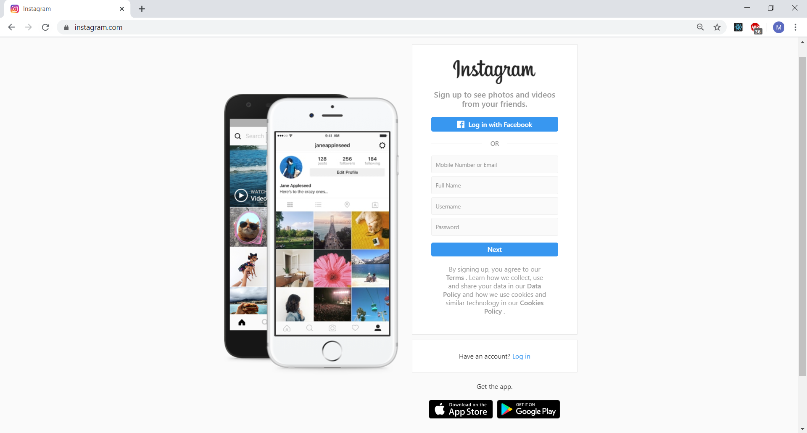

# Instagram Landing Page
Lab to recreate the landing page for Instagram.com. This project was one of the first labs we completed independently at _nology (in week 2). Access to the live version is available [here](https://annikachauhan.github.io/instagram-landing-page/).

This site is made very simply using HTML and CSS, it does not require any additional packages to run.

Details of the task and instructions are below:

## Tasks

Recreate the screenshot as closely as possible using the accompanying assets and semantic HTML including:

* sections
* headers
* img tags
* buttons
* forms

You may have to use FontAwesome to add in the Facebook logo

## Instructions for submission

- Fork this repo
- 10am tomorrow (time to work on it in the morning) 
- Push your finished code up to your personal forked repo
- Send the url for your repo to Ollie by 10am